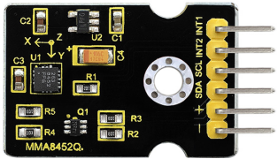
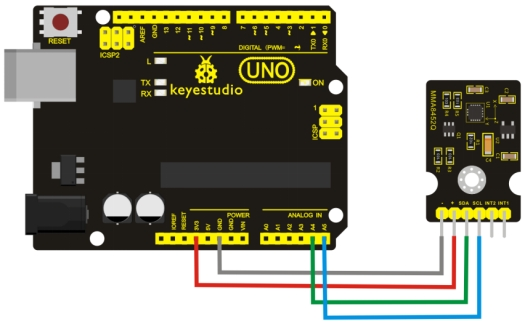
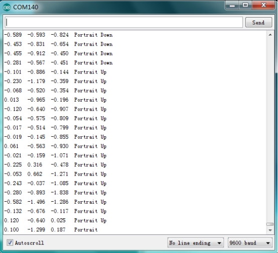
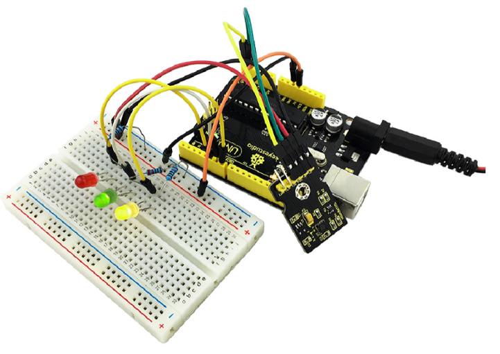

# KS0270 keyestudio MMA8452Q Module Triaxial Digital Acceleration Tilt Sensor



## 1. Introduction

MMA8452Q is a smart low-power, three-axis, capacitive micromachine acceleration sensor with 12-bit resolution.

This acceleration sensor has a rich embedded performance, featured with flexible user programmable options and two interruption pins configuration. 

The embedded interruption function can save the overall power consumption and remove the burden of constantly polling the data in the main processor.

Besides, MMA8452Q has a user optional range of ±2g / ±4g/ ±8g, which can output high-pass filtering data and non-filtered data in real time.

This device can configure an embedded function to generate an inertial wake-up interrupt signal, which enables MMA8452Q to maintain a low-power mode in the static state while monitoring the event.

## 2. Parameters

- Power Supply Voltage： DC 3.3V to 5 V
- ±2g/±4g/±8g Optional dynamic range
- Output data rate (ODR) range：1.56 Hz to 800 Hz
- Noise：99μg/√Hz
- 12 bits and 8 bits digital outputs;
- I2C digital output interface (up to 2.25 MHz when the pull-up resistor is 4.7kΩ);
- Two programmable interruption pins applied to six interruption sources;
- Three motion detection embedded channels: free fall detection, pulse detection, shaking detection;
- Direction (transverse/longitudinal) detection with setting lag compensation;
- Automatic arousal and auto-dormant ODR can be automatically altered;
- High-pass filtering data can be exported in real time;
- Power consumption： 6μA – 165μA

## 3. Connection Diagram



## 4. Sample Code

Download Resources :[Resources](./Resources.7z)

```c
#include <Wire.h> // Must include Wire library for I2C
#include <SparkFun_MMA8452Q.h> // Includes the SFE_MMA8452Q library
// Begin using the library by creating an instance of the MMA8452Q
//  class. We'll call it "accel". That's what we'll reference from
//  here on out.
MMA8452Q accel;
// The setup function simply starts serial and initializes the
//  accelerometer.

void setup()
{
  Serial.begin(9600);
  Serial.println("MMA8452Q Test Code!");
  
  // Choose your adventure! There are a few options when it comes
  // to initializing the MMA8452Q:
  //  1. Default init. This will set the accelerometer up
  //     with a full-scale range of +/-2g, and an output data rate
  //     of 800 Hz (fastest).
  accel.init();
  //  2. Initialize with FULL-SCALE setting. You can set the scale
  //     using either SCALE_2G, SCALE_4G, or SCALE_8G as the value.
  //     That'll set the scale to +/-2g, 4g, or 8g respectively.
  //accel.init(SCALE_4G); // Uncomment this out if you'd like
  //  3. Initialize with FULL-SCALE and DATA RATE setting. If you
  //     want control over how fast your accelerometer produces
  //     data use one of the following options in the second param:
  //     ODR_800, ODR_400, ODR_200, ODR_100, ODR_50, ODR_12,
  //     ODR_6, or ODR_1. 
  //     Sets to 800, 400, 200, 100, 50, 12.5, 6.25, or 1.56 Hz.
  //accel.init(SCALE_8G, ODR_6);
}

// The loop function will simply check for new data from the
//  accelerometer and print it out if it's available.
void loop()
{
  // Use the accel.available() function to wait for new data
  //  from the accelerometer.
  if (accel.available())
  {
    // First, use accel.read() to read the new variables:
    accel.read();
    
    // accel.read() will update two sets of variables. 
    // * int's x, y, and z will store the signed 12-bit values 
    //   read out of the accelerometer.
    // * floats cx, cy, and cz will store the calculated 
    //   acceleration from those 12-bit values. These variables 
    //   are in units of g's.
    // Check the two function declarations below for an example
    // of how to use these variables.
    printCalculatedAccels();
    //printAccels(); // Uncomment to print digital readings
    
    // The library also supports the portrait/landscape detection
    //  of the MMA8452Q. Check out this function declaration for
    //  an example of how to use that.
    printOrientation();
    
    Serial.println(); // Print new line every time.
  }
}

// The function demonstrates how to use the accel.x, accel.y and
//  accel.z variables.
// Before using these variables you must call the accel.read()
//  function!
void printAccels()
{
  Serial.print(accel.x, 3);
  Serial.print("\t");
  Serial.print(accel.y, 3);
  Serial.print("\t");
  Serial.print(accel.z, 3);
  Serial.print("\t");
}

// This function demonstrates how to use the accel.cx, accel.cy,
//  and accel.cz variables.
// Before using these variables you must call the accel.read()
//  function!
void printCalculatedAccels()
{ 
  Serial.print(accel.cx, 3);
  Serial.print("\t");
  Serial.print(accel.cy, 3);
  Serial.print("\t");
  Serial.print(accel.cz, 3);
  Serial.print("\t");
}

// This function demonstrates how to use the accel.readPL()
// function, which reads the portrait/landscape status of the
// sensor.
void printOrientation()
{
  // accel.readPL() will return a byte containing information
  // about the orientation of the sensor. It will be either
  // PORTRAIT_U, PORTRAIT_D, LANDSCAPE_R, LANDSCAPE_L, or
  // LOCKOUT.
  byte pl = accel.readPL();
  switch (pl)
  {
  case PORTRAIT_U:
    Serial.print("Portrait Up");
    break;
  case PORTRAIT_D:
    Serial.print("Portrait Down");
    break;
  case LANDSCAPE_R:
    Serial.print("Landscape Right");
    break;
  case LANDSCAPE_L:
    Serial.print("Landscape Left");
    break;
  case LOCKOUT:
    Serial.print("Flat");
    break;
  }
}
```

## 5. Result

Wiring as the above diagram and burning the code, after powered-on,then open the serial monitor to display the triaxial acceleration of sensor and its status, as the graph shown below.



## 6. Further Learn

You can build your own circuit to make 3 LEDs turn on or off by this MMA8452Q module.As shown below.

